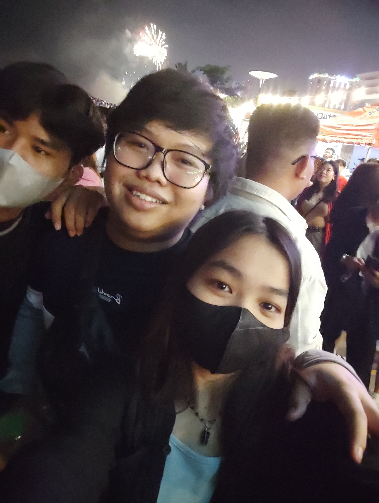

<!DOCTYPE html>
<html>
<head>
  <title>Website Cinta untuk Mira</title>
  
</head>
<body>
  

    <h1>Untuk Mira, Cinta Sejati Saya</h1>
    
    
Halo Mira,

    
Website ini saya buat khusus untukmu karena aku ingin mengungkapkan betapa besar cintaku padamu. Setiap detik bersamamu adalah berkah bagi hidupku. Kamu membuatku tersenyum, kamu membuatku merasa istimewa, dan kamu membuat hidupku berarti.

    
Dalam setiap momen yang kita lewati bersama, aku merasa bahagia dan lengkap. Kamu adalah sosok yang paling berarti dalam hidupku, dan aku bersyukur memiliki kamu di sisiku.

    
Mira, aku ingin kamu tahu bahwa cintaku padamu tidak akan pernah berubah. Aku berjanji untuk selalu mencintaimu dengan segenap hatiku dan melakukan segala yang aku bisa untuk membuatmu bahagia. Bersamamu, aku merasa lengkap dan aku tidak bisa membayangkan hidupku tanpa kamu di dalamnya.

    
Mira, apakah kamu mau menjadi kekasihku? Aku berharap kita bisa melangkah bersama dalam perjalanan cinta ini dan membangun masa depan yang indah bersama.

    
"Cinta sejati tidak pernah berakhir. Cinta sejati akan terus tumbuh dan menguat seiring berjalannya waktu." - [Nama Anda]

  

</body>
</html>
